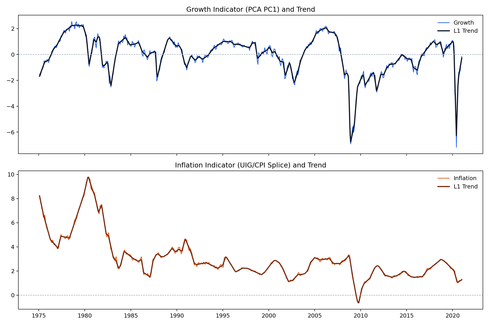
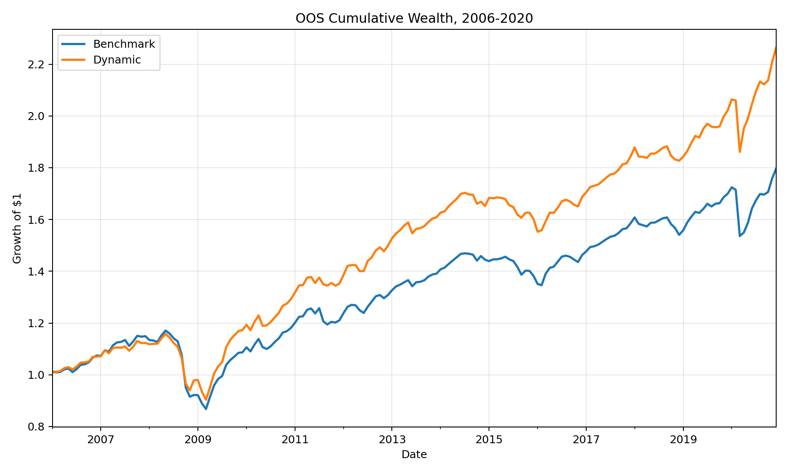
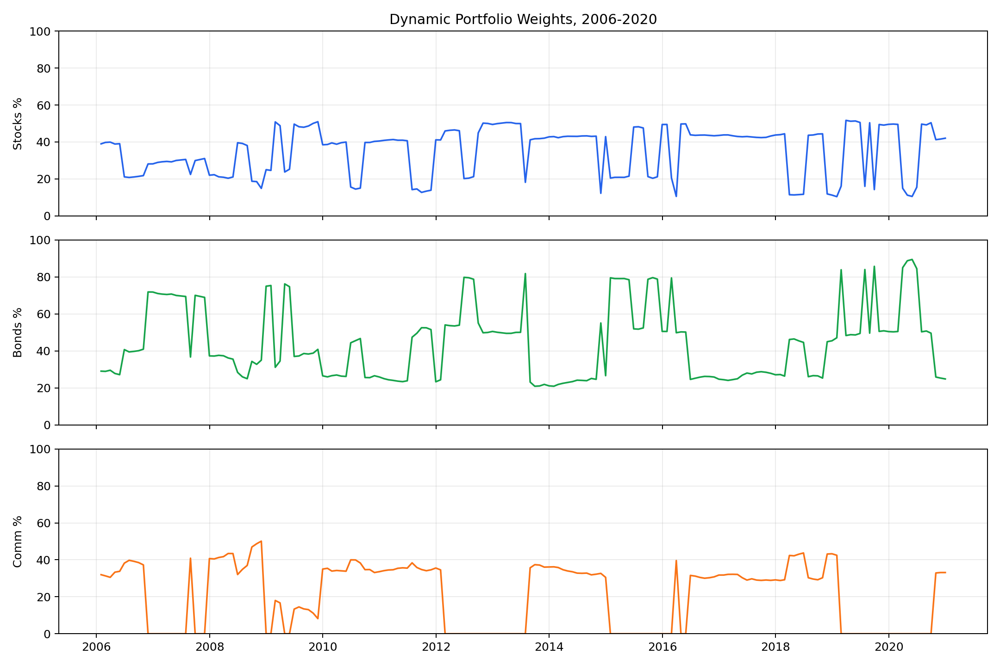
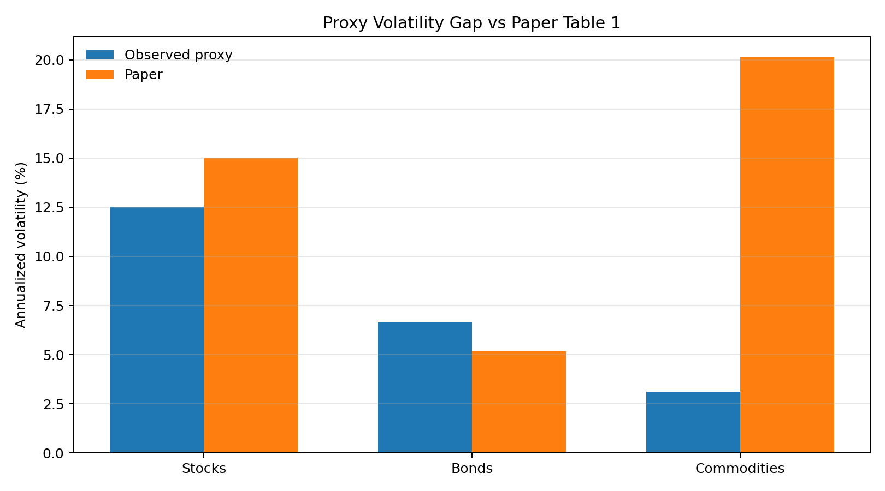

# reprod_kim2023_dynamic_asset_allocation

Reproduction of Kim and Kwon (2023), "Dynamic asset allocation strategy: an economic regime approach," Journal of Asset Management 24, 136-147. The paper first appeared online on November 14, 2022; the repo folder uses the final journal year for naming consistency.

This folder contains the repo-compliant public-data reconstruction of the paper's three-asset regime-allocation model, along with committed validation artifacts and charts.

## Status

The rebuilt production configuration follows the paper specification as closely as public data allow:

- `12/12` Table 2 sign patterns match the paper.
- OOS benchmark annual return: `4.13%` vs paper `3.59%`.
- OOS dynamic annual return: `5.68%` vs paper `5.07%`.
- OOS benchmark Sharpe: `0.46` vs paper `0.56`.
- OOS dynamic Sharpe: `0.70` vs paper `0.77`.
- Dynamic tracking error: `2.21%` vs paper `2.00%`.
- Dynamic information ratio: `0.70` vs paper `0.74`.
- Break-even transaction costs: `1.52%` vs paper `1.95%`.

The dominant residual gap remains the commodity proxy. Public `PPIACO` volatility is `3.13%` annualized versus the paper's `20.17%` for the S&P GSCI total return index, which distorts risk-parity weights and the Black-Litterman posterior.

## Original Sources

- Paper DOI: [10.1057/s41260-022-00296-8](https://doi.org/10.1057/s41260-022-00296-8)
- Open-access precursor: [Kwon (2022), Dynamic factor rotation strategy: A business cycle approach](https://doi.org/10.3390/ijfs10020046)
- L1 trend filtering reference: [Kim, Koh, Boyd, and Gorinevsky (2009)](https://doi.org/10.1137/070690274)
- Black-Litterman / risk-parity references cited by the paper:
  - [Haesen et al. (2017)](https://doi.org/10.3905/joi.2017.26.4.053)
  - [Jurczenko and Teiletche (2018)](https://doi.org/10.3905/jpm.2018.44.3.056)

## Folder Contents

- `data_access.py`: provider-aware public-data fetch layer with FRED clean CSV endpoints and Yahoo daily-price access for the realized-volatility splice
- `model_core.py`: growth and inflation indicator construction, second-difference l1 trend filtering, regime classification, rolling OOS backtest, risk parity, and Black-Litterman optimization
- `regime_model_final.py`: production runner that regenerates the committed validation CSVs and figures
- `scenario_tester.py`: bounded sensitivity checks for `lambda` and a tracking-error-oriented `kappa` calibration diagnostic
- `artifacts/`: committed summary tables and figures generated by the current code

## How The Model Works

The paper defines four economic regimes from growth and inflation momentum:

- `Heating Up`: rising growth, rising inflation
- `Goldilocks`: rising growth, falling inflation
- `Slow Growth`: falling growth, falling inflation
- `Stagflation`: falling growth, rising inflation

Production reconstruction steps:

1. Build a five-variable monthly growth block from yield spread, credit spread, initial jobless claims, building permits, and volatility.
2. Invert every growth component except building permits, lag jobless claims and permits by one month, z-score each component, and extract the first PCA component.
3. Build the inflation indicator from `UIGFULL` beginning in January 1995 and splice pre-1995 CPI year-over-year inflation onto the UIG scale, then lag the combined series by one month.
4. Apply the paper's second-difference l1 trend filter with `lambda = 0.3` to both indicators and classify regimes from the sign of the trend slope.
5. In the OOS test, use a rolling 30-year window, forecast next-month growth and inflation with AR(1), map the predicted regime to regime-conditional expected returns, build a risk-parity benchmark, then tilt it with the Black-Litterman posterior using `delta = 5` and `kappa = 0.09`.

## Data Mapping

| Model element | Production source | Endpoint / contract | Public-data note |
| --- | --- | --- | --- |
| Yield spread | FRED `GS10`, `FEDFUNDS` | clean FRED CSV | monthly values, sign inverted |
| Credit spread | FRED `BAA`, `GS10` | clean FRED CSV | monthly values, sign inverted |
| Initial jobless claims | FRED `IC4WSA` | clean FRED CSV | weekly series averaged to month, then lagged and inverted |
| Building permits | FRED `PERMIT` | clean FRED CSV | monthly series, one-month lag, not inverted |
| Volatility proxy | Yahoo `^GSPC` daily + FRED `VXOCLS` | yfinance-compatible direct download plus clean FRED CSV | realized annualized daily-volatility proxy before 1986, `VXOCLS` monthly average from 1986 onward |
| Inflation indicator | FRED `UIGFULL`, `CPIAUCSL` | clean FRED CSV | UIG from 1995 onward, CPI YoY normalized to UIG scale before 1995, then one-month lag |
| US stocks | FRED `SPASTT01USM657N` | clean FRED CSV | OECD / FRED monthly total return proxy for MSCI USA TR |
| US bonds | FRED `BAMLCC0A0CMTRIV` | clean FRED CSV | BofA index proxy for Barclays US Aggregate TR |
| Commodities | FRED `PPIACO` | clean FRED CSV | PPI proxy for S&P GSCI TR; main residual gap |
| Risk-free rate | FRED `TB3MS` | clean FRED CSV | monthly T-bill rate divided by 12 |

No manual pre-download step is required. Source payloads are cached under the ignored `cache/` directory.

## Reconstruction Notes

The starting `model4` staging materials were not internally trustworthy as executable code:

- `kk2022_regime_model_v2.py` contained corrected v2 comments, but the executable body still used an older six-asset, equal-weight, CPI-only, first-difference, `2000-2020` implementation.
- The transcript and validation dashboards were therefore used as reference memos, not as the production source of truth.
- The new implementation was rebuilt from the paper spec first, then checked against the staging transcript and dashboards to make sure the corrected interpretation was preserved.

Important public-data substitutions:

- `VXOCLS` is used as the public post-1986 volatility series instead of the paper's VIX wording.
- `^GSPC` daily prices supply the pre-1986 realized-volatility splice.
- `SPASTT01USM657N`, `BAMLCC0A0CMTRIV`, and `PPIACO` replace the proprietary MSCI USA TR, Barclays US Aggregate TR, and S&P GSCI TR series.

## Validation Summary

### Table 1 Proxy Gap

| Asset | Observed return | Paper return | Observed vol | Paper vol | Observed Sharpe | Paper Sharpe |
| --- | --- | --- | --- | --- | --- | --- |
| Stocks | `8.32%` | `9.97%` | `12.53%` | `15.03%` | `0.31` | `0.38` |
| Bonds | `7.93%` | `7.03%` | `6.63%` | `5.17%` | `0.54` | `0.53` |
| Commodities | `2.74%` | `3.66%` | `3.13%` | `20.17%` | `-0.52` | `-0.03` |

The commodity volatility gap is the single largest structural mismatch in the reconstruction.

### Table 2 Regime Validation

All `12/12` asset-regime sign patterns match the paper.

Selected examples from [`artifacts/table2_regime_validation.csv`](./artifacts/table2_regime_validation.csv):

| Regime | Asset | Observed return | Paper return | Observed Sharpe | Paper Sharpe |
| --- | --- | --- | --- | --- | --- |
| Heating Up | Stocks | `13.04%` | `16.77%` | `1.14` | `1.27` |
| Goldilocks | Stocks | `18.32%` | `17.19%` | `1.28` | `0.99` |
| Slow Growth | Bonds | `12.82%` | `14.02%` | `0.96` | `1.24` |
| Stagflation | Stocks | `-6.38%` | `-3.27%` | `-0.81` | `-0.45` |

### Table 3 OOS Validation

| Metric | Observed | Paper | Delta |
| --- | --- | --- | --- |
| Benchmark return | `4.13%` | `3.59%` | `+0.54pp` |
| Dynamic return | `5.68%` | `5.07%` | `+0.61pp` |
| Benchmark volatility | `6.51%` | `6.46%` | `+0.05pp` |
| Dynamic volatility | `6.50%` | `6.60%` | `-0.10pp` |
| Benchmark Sharpe | `0.46` | `0.56` | `-0.10` |
| Dynamic Sharpe | `0.70` | `0.77` | `-0.07` |
| Dynamic tracking error | `2.21%` | `2.00%` | `+0.21pp` |
| Dynamic information ratio | `0.70` | `0.74` | `-0.04` |
| Dynamic break-even TC | `1.52%` | `1.95%` | `-0.43pp` |

The complete OOS comparison is committed in [`artifacts/table3_oos_validation.csv`](./artifacts/table3_oos_validation.csv).

## Scenario Validation

The bounded validation sweep is committed in [`artifacts/lambda_scenarios.csv`](./artifacts/lambda_scenarios.csv).

| Lambda | Dynamic Sharpe | Tracking error | Avg turnover | Table 2 sign matches |
| --- | --- | --- | --- | --- |
| `0.1` | `0.84` | `2.48%` | `11.87%` | `11/12` |
| `0.3` | `0.70` | `2.21%` | `8.44%` | `12/12` |
| `0.5` | `0.72` | `2.30%` | `6.87%` | `12/12` |

Interpretation:

- `lambda = 0.3` remains the production setting because it is the paper value and preserves all `12/12` Table 2 sign matches.
- `lambda = 0.1` improves OOS Sharpe in this proxy configuration, but it loses one of the paper's sign-pattern checks and increases turnover materially.
- A tracking-error-oriented `kappa` rescale to `0.0813` produces `2.09%` observed tracking error under the proxy covariance structure; see [`artifacts/kappa_calibration_summary.csv`](./artifacts/kappa_calibration_summary.csv).

## Residual Gaps

Residual mismatch is now driven by public proxies rather than code-spec drift:

- `PPIACO` is a low-volatility producer-price series, not a futures total-return commodity index like the paper's S&P GSCI TR.
- `SPASTT01USM657N` and `BAMLCC0A0CMTRIV` are reasonable but not exact substitutes for MSCI USA TR and Barclays US Aggregate TR.
- The public volatility splice uses `^GSPC` realized volatility plus `VXOCLS`, which is defensible but still not identical to the paper's proprietary workflow.

## Paper Specification Assessment

**Overall specification completeness: ~85%.**

The four-regime framework (Heating Up, Goldilocks, Slow Growth, Stagflation), the growth and inflation indicators, the L1 trend filtering with lambda=0.3, and the Black-Litterman optimization with delta=5.0 and kappa=0.09 are all specified. The main gaps are in data proxy guidance and computational edge cases.

| Ambiguity | Severity | Notes |
| --- | --- | --- |
| Commodity asset: S&P GSCI TR is proprietary | CRITICAL | PPIACO has 3.13% annualized volatility vs GSCI TR's 20.17%. This 17-percentage-point gap distorts risk-parity weights, Black-Litterman posteriors, and all commodity-related metrics. No public free daily total return series replicates GSCI TR. |
| CPI-to-UIG inflation splicing method | MEDIUM | Code normalizes pre-1995 CPI to UIG scale using z-score matching. Paper likely does this but does not specify. |
| PCA orientation rule for growth indicator | LOW | Code orients PC1 to correlate positively with building permits. Paper does not document orientation rule. |
| Risk-free rate monthly conversion | LOW | Code divides TB3MS by 12 (simple). Paper does not specify simple vs compound conversion. |
| Minimum sample size for regime-conditional returns | LOW | Code uses 6 observations. Paper does not state threshold. |
| Black-Litterman confidence scaling derivation | LOW | Paper states kappa=0.09 but does not derive it. |
| Stock and bond proxy substitutions | MEDIUM | SPASTT01USM657N and BAMLCC0A0CMTRIV are reasonable but not exact matches for MSCI USA TR and Barclays US Aggregate TR. Causes approximately 1-2 percentage point return and volatility deltas. |

**Verdict:** The paper is well-specified enough that the regime logic is demonstrably correct --- all 12 regime-asset sign patterns match (12/12). The dynamic Sharpe gap is small (0.70 vs 0.77, 9% shortfall) and attributable primarily to the commodity proxy. This is the most successful reproduction in the repo relative to paper targets, despite having the most severe single data proxy issue (PPIACO for GSCI TR).

## Generated Artifacts

Key tables:

- [`artifacts/table1_proxy_comparison.csv`](./artifacts/table1_proxy_comparison.csv)
- [`artifacts/table2_regime_validation.csv`](./artifacts/table2_regime_validation.csv)
- [`artifacts/table3_oos_validation.csv`](./artifacts/table3_oos_validation.csv)
- [`artifacts/oos_backtest.csv`](./artifacts/oos_backtest.csv)
- [`artifacts/oos_summary.csv`](./artifacts/oos_summary.csv)
- [`artifacts/lambda_scenarios.csv`](./artifacts/lambda_scenarios.csv)
- [`artifacts/kappa_calibration_summary.csv`](./artifacts/kappa_calibration_summary.csv)

Figures:

- [`artifacts/figures/indicator_trends.png`](./artifacts/figures/indicator_trends.png)
- [`artifacts/figures/regime_timeline.png`](./artifacts/figures/regime_timeline.png)
- [`artifacts/figures/cumulative_wealth.png`](./artifacts/figures/cumulative_wealth.png)
- [`artifacts/figures/portfolio_weights.png`](./artifacts/figures/portfolio_weights.png)
- [`artifacts/figures/proxy_volatility_gap.png`](./artifacts/figures/proxy_volatility_gap.png)
- [`artifacts/figures/lambda_sensitivity.png`](./artifacts/figures/lambda_sensitivity.png)

Preview:









## Running The Model

Install dependencies:

```bash
pip install -r requirements.txt
```

Run the production configuration:

```bash
python regime_model_final.py --artifacts-dir ./artifacts
```

Run the bounded validation sweep:

```bash
python scenario_tester.py --artifacts-dir ./artifacts
```

Raw source downloads are not committed. The workspace-local `cache/` directory is intentionally ignored by Git.
