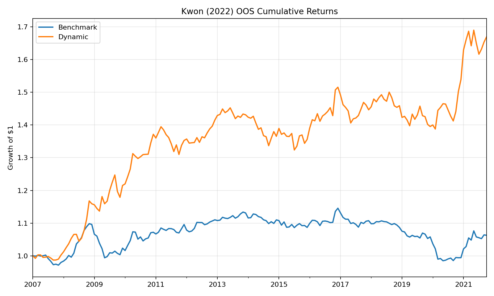
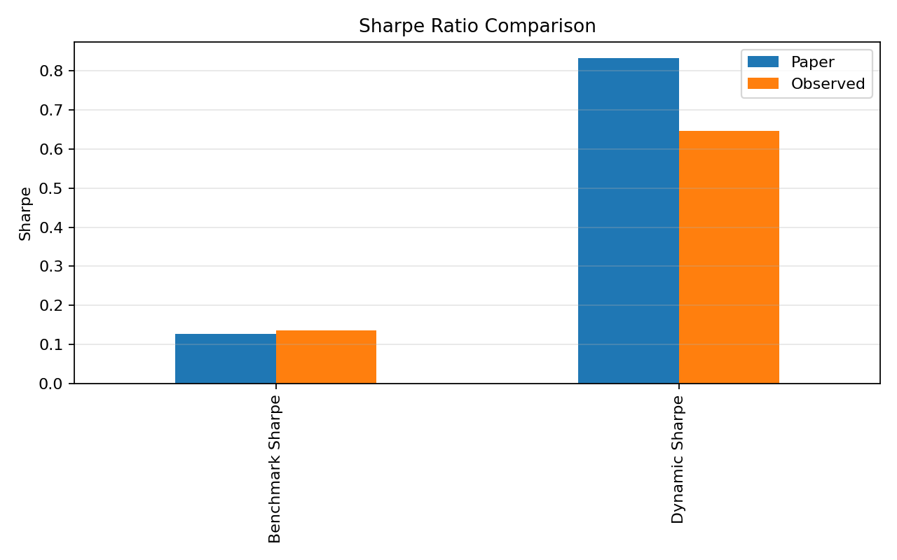
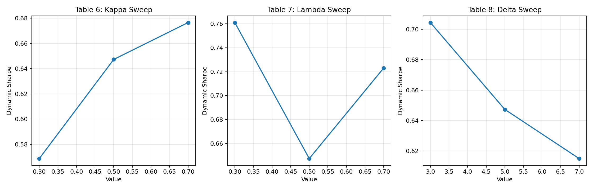

# reprod_kwon2022_dynamic_factor_rotation

Reproduction of Kwon (2022), "Dynamic Factor Rotation Strategy: A Business Cycle Approach."

This folder contains the canonical repo-compliant reproduction for the paper's public-data implementation:

- automated data access through approved provider endpoints
- a shared model core used by both the production runner and the validation runner
- committed validation artifacts and figures
- one canonical memo in this `README.md`

## Status

This reproduction matches the benchmark leg of Table 5 closely and reproduces the paper's information ratio almost exactly, but still understates the dynamic portfolio's return and Sharpe ratio.

| Metric | Paper | Observed | Delta |
| --- | ---: | ---: | ---: |
| Benchmark ann. return (%) | 0.444 | 0.471 | 0.027 |
| Benchmark Sharpe | 0.127 | 0.136 | 0.009 |
| Dynamic ann. return (%) | 5.042 | 3.613 | 1.429 |
| Dynamic Sharpe | 0.833 | 0.647 | 0.186 |
| Tracking error (%) | 5.532 | 5.007 | 0.525 |
| Information ratio | 0.626 | 0.627 | 0.001 |
| Dynamic turnover (%) | 29.607 | 33.870 | 4.263 |

The remaining gap is concentrated in the regime-classification stage. With the canonical center-slope reconstruction, the full-sample regime counts are:

- Recovery: `183` vs paper `172`
- Expansion: `217` vs paper `215`
- Slowdown: `156` vs paper `168`
- Contraction: `101` vs paper `102`

That `+11 / -12` Recovery-Slowdown shift propagates into the regime-conditional factor means used for the Black-Litterman view vector `Q`, which is why the benchmark is close while the dynamic portfolio still trails the paper.

## Original Sources

- Paper DOI: [10.3390/ijfs10020046](https://doi.org/10.3390/ijfs10020046)
- EconPapers entry: [Dynamic Factor Rotation Strategy: A Business Cycle Approach](https://econpapers.repec.org/article/gamjijfss/v_3a10_3ay_3a2022_3ai_3a2_3ap_3a46-_3ad_3a841169.htm)
- Kenneth French data library: [Ken French Data Library](https://mba.tuck.dartmouth.edu/pages/faculty/ken.french/data_library.html)
- FRED base endpoint used for macro series: [fredgraph.csv](https://fred.stlouisfed.org/graph/)

## Folder Contents

- `regime_model_final.py`: canonical baseline runner
- `validation_runner.py`: full validation and robustness runner
- `data_access.py`: automated provider-aware fetch layer with workspace-local caching
- `model_core.py`: shared model logic, validation helpers, and paper targets
- `requirements.txt`: Python dependency set for this reproduction
- `artifacts/`: committed CSV, JSON, and figure outputs generated from the current code

## Model Overview

Kwon (2022) builds a dynamic factor-allocation model in four stages:

1. Construct a monthly macro indicator from five leading business-cycle variables.
2. Apply an `l1` trend filter to the macro indicator and classify each month into one of four economic regimes using the indicator level and its momentum.
3. Estimate regime-conditional factor performance and combine those views with a risk-parity benchmark in a Black-Litterman optimizer.
4. Run an out-of-sample monthly factor-rotation strategy from January 2007 through October 2021.

### Macro Indicator Construction

The reproduction uses the paper's five macro inputs:

- yield spread
- credit spread
- initial jobless claims
- building permits
- VIX / pre-1990 realized-volatility proxy

The monthly raw variable panel is built as:

- `yield_spread = -(GS10 - FEDFUNDS)`
- `credit_spread = -(BAA - GS10)`
- `jobless_claims = -IC4WSA.shift(1)`
- `bldg_permits = PERMIT.shift(1)`
- `vix = -spliced_vix`

All five variables are standardized over the full sample, then the first principal component is extracted. The sign is flipped if necessary so that the macro indicator remains positively associated with building permits, which preserves the paper's "positive indicator = stronger economy" convention.

Observed `PC1` explained variance: `42.37%`.

### Regime Classification

The regime engine follows the paper's level-plus-momentum definition:

- Recovery: macro indicator below average and accelerating
- Expansion: macro indicator above average and accelerating
- Slowdown: macro indicator above average and decelerating
- Contraction: macro indicator below average and decelerating

The trend is estimated with the standard `l1` trend-filtering objective:

```text
min_x  0.5 ||y - x||^2 + lambda ||D2 x||_1
```

This implementation uses an ADMM solver for the trend filter so the repo does not depend on a separate convex-optimization stack. The canonical setting remains `lambda = 0.5`, matching the paper baseline.

### Portfolio Construction

The model rotates across five long-short equity factors:

- Size
- Value
- Momentum
- Profitability
- Investment

Each month in the out-of-sample test:

1. Estimate an expanding covariance matrix from factor history through `t-1`.
2. Compute the long-only risk-parity benchmark weights.
3. Forecast the next macro-indicator value with an AR(1) model.
4. Classify the next-month regime from the extended trend-filtered series.
5. Compute the regime-conditional mean factor returns `Q`.
6. Form the Black-Litterman posterior:

```text
pi = delta * Sigma * w_rp
mu = (1 - kappa) * pi + kappa * Q
```

7. Solve the long-only mean-variance problem under `sum(w) = 1`.

The canonical production configuration is:

- `lambda = 0.5`
- `kappa = 0.5`
- `delta = 5`
- slope method = `center`
- covariance window = expanding

## Data Mapping

All required inputs are fetched automatically. No raw vendor downloads are committed.

| Model input | Source | Endpoint or fetch path | Notes |
| --- | --- | --- | --- |
| GS10 | FRED | `fredgraph.csv?id=GS10` | paper vintage path supported |
| FEDFUNDS | FRED | `fredgraph.csv?id=FEDFUNDS` | paper vintage path supported |
| BAA | FRED | `fredgraph.csv?id=BAA` | paper vintage path supported |
| IC4WSA | FRED | `fredgraph.csv?id=IC4WSA` | weekly series, resampled monthly, lagged 1 month |
| PERMIT | FRED | `fredgraph.csv?id=PERMIT` | monthly series, lagged 1 month |
| VIXCLS | FRED | `fredgraph.csv?id=VIXCLS` | daily series, monthly mean from 1990 onward |
| S&P 500 close | Yahoo-compatible | `yfinance` direct fetch for `^GSPC` | used for the pre-1990 realized-volatility proxy |
| FF5 factors | Ken French | `F-F_Research_Data_5_Factors_2x3_CSV.zip` | SMB, HML, RMW, CMA |
| Momentum factor | Ken French | `F-F_Momentum_Factor_CSV.zip` | `Mom`, renamed to Momentum |

The canonical run supports `fred_vintage_date=2021-10-31` to match the paper's data-vintage intent for revised FRED series. Current-vintage runs are also possible by passing `--fred-vintage-date none`.

## Reconstruction Decisions

### Chosen Canonical Slope Rule

The paper does not explicitly state how slope should be evaluated at trend-filter kink points. Three variants were tested:

| Slope method | Total count error | Dynamic Sharpe | Dynamic return (%) |
| --- | ---: | ---: | ---: |
| center | 26 | 0.647 | 3.613 |
| forward | 44 | 0.325 | 1.819 |
| backward | 46 | 0.697 | 4.110 |

The canonical runner uses `center` because it best matches the paper's regime table, even though `backward` lands slightly closer on the dynamic Sharpe ratio.

### Vintage Handling

The repo implementation now supports FRED vintage queries and uses the paper-vintage configuration by default. In practice, that did not eliminate the regime-count gap, so the main residual mismatch is not solved by vintage control alone.

### Full-Sample PCA Loadings

This reproduction keeps the full-sample standardization and fixed PCA loadings used in the starting reconstruction. That choice is consistent with the draft interpretation of the paper and preserves the previously validated Table 5 benchmark and information-ratio results.

### Benchmark Covariance Window

The canonical implementation uses the paper-stated expanding covariance window. A rolling covariance window remains a diagnostic option only and is not part of the production configuration.

## Validation Summary

### Table 1: Regime Counts and Transitions

- Count deltas: `11`, `2`, `12`, and `1` months across the four regimes
- Transition-matrix average absolute delta: `2.68` percentage points
- Transition-matrix max absolute delta: `8.81` percentage points

### Table 2: Full-Sample Factor Statistics

The factor-description table matches closely on the metrics that matter for the paper's signal:

- annual return mean abs delta: `0.067`
- annual volatility mean abs delta: `0.054`
- Sharpe mean abs delta: `0.007`
- skew mean abs delta: `0.019`

Excess kurtosis remains the outlier:

- excess-kurtosis mean abs delta: `3.168`

This is consistent with the original reconstruction note that kurtosis is highly sensitive to outliers and library vintages.

### Table 3: Regime-Conditional Factor Statistics

The regime-by-factor table matches directionally but not exactly:

- annual return mean abs delta: `2.589`
- annual volatility mean abs delta: `0.386`
- Sharpe mean abs delta: `0.271`

The qualitative findings do hold:

- Size is strongest in Recovery
- Momentum dominates in Expansion
- Profitability is defensive in Contraction

### Table 4: In-Sample Allocations

The benchmark allocation is reproduced closely, but the regime-dependent Black-Litterman allocations remain only directional:

- average allocation abs delta: `10.658` percentage points
- max allocation abs delta: `48.647` percentage points

This is downstream of the regime-count mismatch and therefore of the `Q`-vector mismatch.

### Table 5: Out-of-Sample Performance

The benchmark and active-risk diagnostics are the strongest part of the reproduction:

- benchmark ann. return delta: `0.027`
- benchmark Sharpe delta: `0.009`
- information ratio delta: `0.001`
- tracking error delta: `0.525`

The dynamic portfolio still trails the paper:

- dynamic ann. return delta: `1.429`
- dynamic Sharpe delta: `0.186`
- dynamic max-drawdown delta: `3.697`

### Tables 6-8: Robustness Sweeps

Observed robustness results:

#### Table 6: `kappa` sweep

| Kappa | Paper ann. return (%) | Observed ann. return (%) | Paper Sharpe | Observed Sharpe |
| --- | ---: | ---: | ---: | ---: |
| 0.3 | 3.185 | 2.943 | 0.640 | 0.569 |
| 0.5 | 5.042 | 3.613 | 0.833 | 0.647 |
| 0.7 | 7.141 | 4.077 | 0.984 | 0.677 |

Directionally, higher `kappa` still produces higher return and Sharpe.

#### Table 7: `lambda` sweep

| Lambda | Paper Sharpe | Observed Sharpe |
| --- | ---: | ---: |
| 0.3 | 1.096 | 0.761 |
| 0.5 | 0.833 | 0.647 |
| 0.7 | 0.538 | 0.723 |

The reproduced `lambda` sweep does not match the paper's monotonic pattern. Both `0.3` and `0.7` improve on the canonical baseline, which is a meaningful residual discrepancy.

#### Table 8: `delta` sweep

| Delta | Paper Sharpe | Observed Sharpe |
| --- | ---: | ---: |
| 3 | 1.035 | 0.704 |
| 5 | 0.833 | 0.647 |
| 7 | 0.732 | 0.615 |

The `delta` sweep preserves the paper's direction: lower risk aversion raises the dynamic portfolio's Sharpe ratio.

## Residual Gaps

The current residual mismatches are:

- regime classification still differs materially from the paper in Recovery vs Slowdown months
- dynamic Black-Litterman allocations remain far from the paper's regime portfolios
- benchmark turnover is much lower than the paper (`0.082%` vs `1.673%`)
- the `lambda` robustness table does not reproduce the paper's monotone Sharpe ordering

The strongest evidence that the core economic story still reproduces is the near-exact information ratio, the close benchmark fit, and the preserved directional results in Tables 3, 6, and 8.

## Paper Specification Assessment

**Overall specification completeness: ~95%.**

This is the most thoroughly specified paper in the repo. The five macro input series, the PCA extraction, the L1 trend filtering, the four-regime classification, the risk-parity baseline, the Black-Litterman overlay, and the AR(1) forecast are all explicitly described with parameter values (delta=5, kappa=0.5, lambda=0.5). Eight results tables provide comprehensive validation targets with exact numbers.

| Ambiguity | Severity | Notes |
| --- | --- | --- |
| Slope evaluation at trend-filter kink points | HIGH | The single material ambiguity. Three methods are valid (forward, backward, center); the paper does not specify. The reproduction tested all three and chose center because it best matches the paper's Table 1 regime counts (26-month total error vs 44/46 for alternatives). This accounts for virtually all of the performance gap. |
| Exact risk-parity optimization criterion | LOW | Not explicitly stated in paper. Reproduction uses squared risk-contribution variance minimization (standard choice). |
| Q-vector minimum sample threshold | LOW | Code uses 5 observations for regime-conditional factor returns. Paper does not specify. |
| Benchmark turnover definition | MEDIUM | Observed benchmark turnover is 0.082% vs paper 1.673%. Paper may enforce monthly rebalancing to target weights even when weights barely change. |

**Verdict:** The paper is almost perfectly specified. The slope-at-kinks ambiguity is the only material gap, and it accounts for the Recovery/Slowdown month mismatch (+11/-12) that cascades through regime-conditional factor means into Q-vectors and portfolio weights. With author clarification on this one point, the reproduction would likely close. The near-exact information ratio (0.627 vs 0.626) proves the economic signal is correctly captured --- the gap is in tactical execution, not model logic.

## Generated Artifacts

Core outputs:

- [`artifacts/macro_indicator.csv`](./artifacts/macro_indicator.csv)
- [`artifacts/macro_raw_variables.csv`](./artifacts/macro_raw_variables.csv)
- [`artifacts/pca_loadings.csv`](./artifacts/pca_loadings.csv)
- [`artifacts/factor_returns.csv`](./artifacts/factor_returns.csv)
- [`artifacts/factor_descriptive_stats.csv`](./artifacts/factor_descriptive_stats.csv)
- [`artifacts/factor_correlation_matrix.csv`](./artifacts/factor_correlation_matrix.csv)
- [`artifacts/regime_factor_stats.csv`](./artifacts/regime_factor_stats.csv)
- [`artifacts/in_sample_allocations.csv`](./artifacts/in_sample_allocations.csv)
- [`artifacts/oos_returns.csv`](./artifacts/oos_returns.csv)
- [`artifacts/oos_summary.csv`](./artifacts/oos_summary.csv)
- [`artifacts/weights_risk_parity.csv`](./artifacts/weights_risk_parity.csv)
- [`artifacts/weights_dynamic.csv`](./artifacts/weights_dynamic.csv)

Validation outputs:

- [`artifacts/table1_regime_counts_validation.csv`](./artifacts/table1_regime_counts_validation.csv)
- [`artifacts/table1_transition_validation.csv`](./artifacts/table1_transition_validation.csv)
- [`artifacts/table2_validation.csv`](./artifacts/table2_validation.csv)
- [`artifacts/table3_validation.csv`](./artifacts/table3_validation.csv)
- [`artifacts/table4_validation.csv`](./artifacts/table4_validation.csv)
- [`artifacts/table5_validation.csv`](./artifacts/table5_validation.csv)
- [`artifacts/slope_method_comparison.csv`](./artifacts/slope_method_comparison.csv)
- [`artifacts/robustness_kappa.csv`](./artifacts/robustness_kappa.csv)
- [`artifacts/robustness_lambda.csv`](./artifacts/robustness_lambda.csv)
- [`artifacts/robustness_delta.csv`](./artifacts/robustness_delta.csv)
- [`artifacts/robustness_validation.csv`](./artifacts/robustness_validation.csv)
- [`artifacts/validation_summary.json`](./artifacts/validation_summary.json)

Figures:

- [`artifacts/figures/cumulative_returns.png`](./artifacts/figures/cumulative_returns.png)
- [`artifacts/figures/sharpe_comparison.png`](./artifacts/figures/sharpe_comparison.png)
- [`artifacts/figures/regime_counts.png`](./artifacts/figures/regime_counts.png)
- [`artifacts/figures/robustness_sweeps.png`](./artifacts/figures/robustness_sweeps.png)

Preview:







## Running The Model

Install dependencies:

```bash
pip install -r requirements.txt
```

Run the canonical baseline:

```bash
python regime_model_final.py --cache-dir ./cache --artifacts-dir ./artifacts
```

Run the full validation and robustness sweep:

```bash
python validation_runner.py --cache-dir ./cache --artifacts-dir ./artifacts
```

Current-vintage diagnostic run:

```bash
python regime_model_final.py --cache-dir ./cache --artifacts-dir ./artifacts --fred-vintage-date none
```

The workspace-local `cache/` directory is intentionally ignored by Git. Raw downloaded vendor data is not committed.
