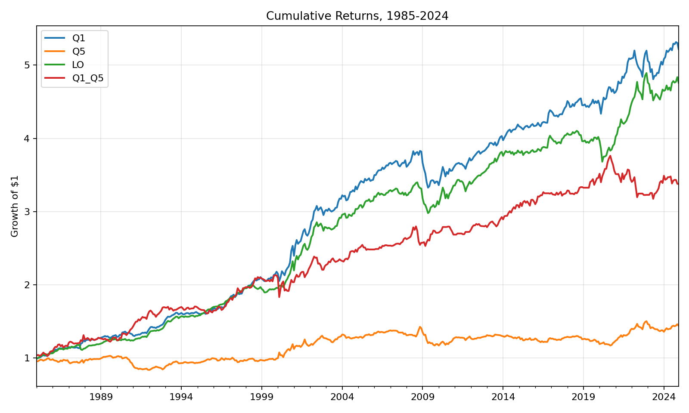
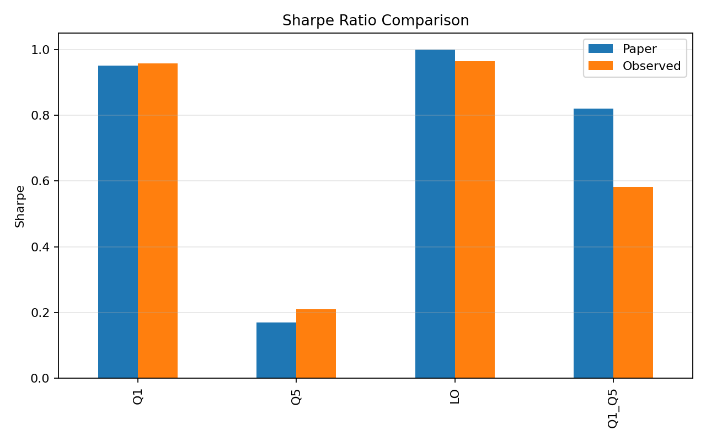
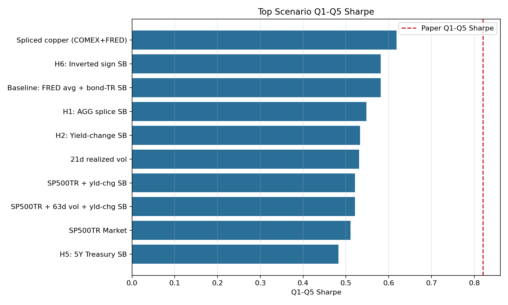

# reprod_mulliner2025_regimes

Reproduction of Mulliner, Harvey, Xia, Fang, and Van Hemert (2025), "Regimes."

This folder contains:

- the production reproduction used for the selected public-data configuration
- the scenario tester used to evaluate source and proxy sensitivity
- committed validation artifacts and charts

## Status

This reproduction materially matches the paper's central public-data result:

- `Q1 Sharpe = 0.96` vs paper `0.95`
- `Q5 Sharpe = 0.21` vs paper `0.17`
- `Long-only Sharpe = 0.96` vs paper `1.00`
- `Q1-Q5 Sharpe = 0.58` vs paper `0.82`
- `Q1-Q5 t-stat = 3.68` vs paper `3.00`

The residual gap is concentrated in the stock-bond correlation variable. The paper reports a Monetary Policy x Stock-Bond cross-correlation of `-0.36`; the best public-data baseline here remains `+0.27`, which is consistent with the original memo's conclusion that Bloomberg bond data likely drives most of the remaining spread difference.

## Original Sources

- Paper: [SSRN abstract 5164863](https://ssrn.com/abstract=5164863)
- Man Group article: [Regimes, Systematic Models and the Power of Prediction](https://www.man.com/insights/regimes-systematic-models-power-of-prediction)
- Fama-French data library: [Ken French Data Library](https://mba.tuck.dartmouth.edu/pages/faculty/ken.french/data_library.html)

## Folder Contents

- `regime_model_final.py`: production runner for the selected configuration
- `scenario_tester.py`: scenario-validation runner across alternative source and proxy choices
- `data_access.py`: provider-aware fetchers aligned with current `dachent/mdt` endpoint patterns
- `model_core.py`: model logic, transformations, distance ranking, portfolio construction, and validation summaries
- `artifacts/`: committed summary outputs generated from the current code

## How The Model Works

The paper defines a seven-variable macro state vector:

- Market
- Yield curve
- Oil
- Copper
- Monetary policy
- Volatility
- Stock-bond correlation

For each variable:

1. compute the 12-month change
2. divide by the rolling 10-year standard deviation of that 12-month change
3. clip to `[-3, 3]`

Important detail: this is not a demeaned z-score. The paper divides by rolling volatility but does not subtract a rolling mean.

For each month `T`, the model:

1. computes Euclidean distance from the current seven-dimensional state to all eligible historical months
2. excludes the most recent 36 months from the analog set
3. sorts the eligible analogs into five similarity quintiles
4. averages the factor returns that followed each analog month
5. goes long a factor if its average next-month return was positive and short if negative
6. equal-weights the six factor positions

The six timed factors are:

- Market
- Size
- Value
- Profitability
- Investment
- Momentum

## Data Mapping

The selected production configuration uses fully automated, `mdt`-consistent data access.

| Model variable | Selected source | Endpoint or helper | Notes |
| --- | --- | --- | --- |
| Market | Yahoo `^GSPC` | direct yfinance-compatible fetch | price-only S&P 500 |
| Yield curve | FRED `GS10 - TB3MS` | direct FRED CSV endpoint | monthly averages |
| Oil | FRED `WTISPLC` | direct FRED CSV endpoint | monthly averages, full history from 1946 |
| Copper | Macrotrends COMEX copper | Macrotrends JSON endpoint | daily series sampled to month-end |
| Monetary policy | FRED `TB3MS` | direct FRED CSV endpoint | monthly averages |
| Volatility | realized vol + Yahoo `^VIX` | yfinance-compatible fetch | 63-day realized vol before VIX history, VIX thereafter |
| Stock-bond correlation | `^GSPC` vs bond TR from `^TNX` | yfinance-compatible fetch | 3-year rolling daily correlation |
| Factors | Fama-French 5 factors + momentum | Ken French ZIP feeds | monthly returns |

Optional scenario-only inputs:

- EIA daily WTI history workbook
- FRED `PCOPPUSDM` copper monthly series
- Yahoo `AGG`, `^SP500TR`, and `^FVX`

## Reconstruction Notes

This implementation follows the paper and the original reconstruction memo:

- monthly FRED averages are used for `GS10`, `TB3MS`, and `WTISPLC`
- `^GSPC` is price-only, not total return, for the Market state variable
- copper uses Macrotrends COMEX daily history sampled to month-end
- the pre-1990 volatility splice uses 63-day realized volatility before the VIX series begins
- stock-bond correlation is computed from daily stock returns and carry-plus-duration bond total returns derived from `^TNX`

The fetch layer uses current-provider endpoints rather than manual local downloads. On this machine, Python HTTPS calls to FRED intermittently reset; `data_access.py` therefore includes a Node `fetch` transport fallback for FRED only when the standard Python transports fail. The source remains FRED; only the transport changes.

## Validation Summary

Selected production configuration:

- `Baseline: FRED avg + bond-TR SB`

Observed performance over the paper's `1985-2024` reporting window:

| Metric | Paper | Observed | Assessment |
| --- | --- | --- | --- |
| Q1 Sharpe | 0.95 | 0.96 | match |
| Q5 Sharpe | 0.17 | 0.21 | match |
| Long-only Sharpe | 1.00 | 0.96 | match |
| Q1-Q5 Sharpe | 0.82 | 0.58 | close |
| Q1 Corr(LO) | 0.76 | 0.64 | close |
| Q5 Corr(LO) | 0.48 | 0.52 | match |
| Q1-Q5 t-stat | 3.00 | 3.68 | close |

Cross-correlation diagnostics:

| Pair | Paper | Observed | Assessment |
| --- | --- | --- | --- |
| Oil x Copper | 0.33 | 0.41 | match |
| Monetary policy x Yield curve | -0.67 | -0.76 | match |
| Volatility x Market | -0.25 | -0.42 | close |
| Monetary policy x Stock-bond | -0.36 | 0.27 | gap |
| Copper x Monetary policy | 0.37 | 0.29 | match |
| Copper x Market | 0.13 | 0.13 | match |

Why the reproduction still differs from the paper:

- the stock-bond correlation variable remains the dominant residual gap
- public Treasury-based proxies do not reproduce the paper's negative Monetary Policy x Stock-Bond cross-correlation
- the memo's original conclusion still holds: Bloomberg bond index data likely explains most of the missing `Q1-Q5` spread

## Scenario Validation

The full scenario sweep is committed in [`artifacts/scenario_results.csv`](./artifacts/scenario_results.csv).

Top scenarios from the current run:

| Configuration | Q1-Q5 Sharpe | Q1-Q5 t-stat | MP x SB | Score |
| --- | --- | --- | --- | --- |
| Spliced copper (COMEX+FRED) | 0.62 | 3.91 | 0.27 | 4 |
| H6: Inverted sign SB | 0.58 | 3.68 | -0.27 | 5 |
| Baseline: FRED avg + bond-TR SB | 0.58 | 3.68 | 0.27 | 4 |
| H1: AGG splice SB | 0.55 | 3.47 | 0.06 | 4 |
| H2: Yield-change SB | 0.53 | 3.37 | -0.27 | 5 |

Interpretation:

- the selected baseline best matches the memo's intended public-data configuration
- alternative stock-bond constructions can improve the sign of the MP x SB cross-correlation, but they do not close the full spread gap
- end-of-month oil snapshots remain destructive, consistent with the original memo

## Paper Specification Assessment

**Overall specification completeness: ~90%.**

The paper is well-specified. The seven-variable state vector, the Euclidean distance analog matching, the quintile sorting, and the equal-weight factor timing are all clearly described. The ambiguities are concentrated in data construction details rather than the core algorithm.

| Ambiguity | Severity | Notes |
| --- | --- | --- |
| Z-score definition: divide by rolling 10yr std only, or also demean? | MEDIUM | Resolved in code as no demeaning (divide by rolling volatility only, no mean subtraction). Material because it means transformed variables retain level information. |
| Bond total return construction for stock-bond correlation | HIGH | Paper does not specify the duration model used to convert yields to bond total returns. The reproduction uses carry-plus-duration from 10Y yields. This is the dominant residual gap (MP x SB correlation: +0.27 observed vs -0.36 paper). |
| Rolling window minimum-periods handling | LOW | Code uses min_periods=60 for a 120-month window. Paper does not specify. |
| Volatility pre-1990 splice methodology | LOW | Code uses 63-day realized volatility before VIX history. Paper does not specify the splice date or realized-vol calculation. |
| Copper source (COMEX vs LME, daily vs monthly) | LOW | Code uses Macrotrends COMEX daily sampled to month-end. Paper does not specify. |
| Minimum analog history threshold | LOW | Code requires 50 valid analogs (quintiles x 10). Paper does not specify. |

**Verdict:** With Bloomberg bond index data (to fix the stock-bond correlation sign), this reproduction would likely match closely. The public-data limitation is narrow and well-identified. The algorithm itself is faithfully reproduced --- Q1 Sharpe matches nearly exactly (0.957 vs 0.95), and the Q1-Q5 Sharpe gap (0.58 vs 0.82) traces specifically to the stock-bond correlation variable.

## Generated Artifacts

Committed outputs:

- [`artifacts/performance_stats.csv`](./artifacts/performance_stats.csv)
- [`artifacts/validation_summary.csv`](./artifacts/validation_summary.csv)
- [`artifacts/zscore_summary.csv`](./artifacts/zscore_summary.csv)
- [`artifacts/correlation_summary.csv`](./artifacts/correlation_summary.csv)
- [`artifacts/scenario_results.csv`](./artifacts/scenario_results.csv)

Figures:

- [`artifacts/figures/cumulative_returns.png`](./artifacts/figures/cumulative_returns.png)
- [`artifacts/figures/sharpe_comparison.png`](./artifacts/figures/sharpe_comparison.png)
- [`artifacts/figures/scenario_q1_q5_sharpe.png`](./artifacts/figures/scenario_q1_q5_sharpe.png)

Preview:







## Running The Model

Python dependencies:

```bash
pip install -r requirements.txt
```

Recommended runtime environment:

- Python 3.10+
- Node 18+ available on `PATH`

Run the selected production configuration:

```bash
python regime_model_final.py --artifacts-dir ./artifacts
```

Run the full scenario sweep:

```bash
python scenario_tester.py --artifacts-dir ./artifacts
```

Quick scenario sweep:

```bash
python scenario_tester.py --artifacts-dir ./artifacts --quick
```

Raw vendor data is not committed. The workspace-local `cache/` directory is intentionally ignored by Git.
