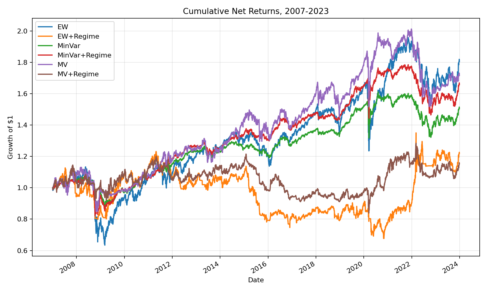
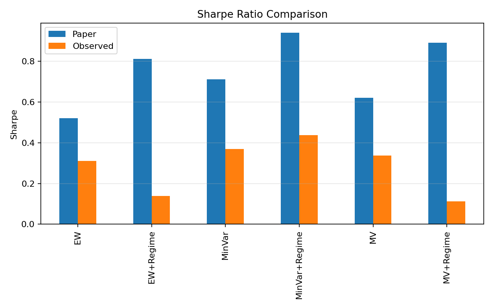
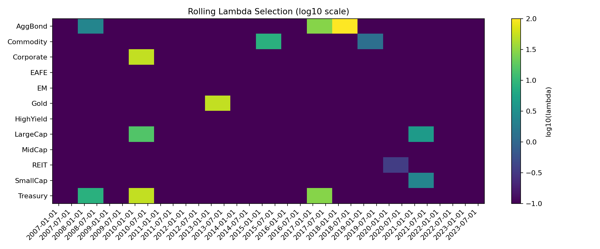

# reprod_shu2025_asset_specific_regime_forecasts

Reproduction of Shu, Yu, and Mulvey (2025), "Dynamic asset allocation with asset-specific regime forecasts," *Annals of Operations Research* 346, 285-318.

This folder contains the repo-compliant public-data reconstruction of the paper's three-stage regime allocation model, along with committed validation tables and charts generated by the current code. Three separate reproduction attempts have been completed; none yet reproduces the paper's economics. This README documents what was tried, why it failed, and what a successful reproduction would require.

## Status

Three attempts have been made. All achieve mechanical correctness but none reproduces the paper's regime uplift. The regime signal --- the paper's core contribution --- produces near-zero or negative uplift in every reproduction.

| Strategy | Paper | Attempt 1 (Codex 5.4 xHigh) | Attempt 2 (Kimi K2.5) | Attempt 3 (Qwen 3.6 Plus) |
| --- | --- | --- | --- | --- |
| EW | `0.52` | `0.31` | `0.31` | `0.31` |
| EW+Regime | `0.81` | `0.14` | `0.14` | `0.33` |
| MinVar | `0.71` | `0.37` | `0.37` | `0.37` |
| MinVar+Regime | `0.94` | `0.44` | `0.44` | `0.50` |
| MV | `0.62` | `0.34` | `0.34` | `0.34` |
| MV+Regime | `0.89` | `0.11` | `0.11` | `0.24` |

Regime uplift (regime Sharpe minus baseline Sharpe):

| Strategy | Paper Uplift | Attempt 1 | Attempt 3 |
| --- | --- | --- | --- |
| EW+Regime - EW | `+0.29` | `-0.17` | `+0.02` |
| MinVar+Regime - MinVar | `+0.23` | `+0.07` | `+0.13` |
| MV+Regime - MV | `+0.27` | `-0.22` | `-0.09` |

Best observed regime uplift across all attempts: `+0.13` Sharpe (MinVar, Attempt 3). Paper claims `+0.23`. The regime signal remains qualitatively broken, not just quantitatively weaker.

The committed code and artifacts in this folder reflect Attempt 1. Attempt 2 produced no code changes (diagnosis only). Attempt 3 is archived separately in `reprod_shu2025_03_qwen36` and is not merged here because its changes further diverge from the paper's specification.

## Original Sources

- Paper DOI: [10.1007/s10479-024-06266-0](https://doi.org/10.1007/s10479-024-06266-0)
- arXiv preprint: [2406.09578](https://arxiv.org/abs/2406.09578)
- Jump Model package by the paper's first author: [jumpmodels](https://github.com/Yizhan-Oliver-Shu/jump-models)

## Folder Contents

- `data_access.py`: `aMDT`-compatible fetch layer for Yahoo-style ETF data, FRED macro series, and CBOE VIX history
- `model_core.py`: Jump Model features, XGBoost forecasts, rolling lambda logic, portfolio construction, validation summaries, and artifact generation
- `regime_model_final.py`: production runner for the selected configuration
- `artifacts/`: committed summary tables, lambda history, source mapping, and figures generated by the current code

## How The Model Works

The paper's pipeline has three stages.

### Stage 1: Statistical Jump Model

Each asset gets its own two-state Jump Model on daily excess returns.

Jump Model features follow Table 2:

- downside deviation, log-scaled, halflives `5` and `21`
- exponentially weighted average return, halflives `5`, `10`, and `21`
- exponentially weighted Sortino ratio, halflives `5`, `10`, and `21`

Per footnote 16, downside-deviation features are excluded for `AggBond`, `Treasury`, and `Gold` in the JM step only.

The code uses the paper-correct log-spaced lambda grid from `0.1` to `100.0` with `25` candidates. The lower bound is `0.1` rather than literal zero because a logarithmic grid cannot include `0.0`.

### Stage 2: XGBoost Regime Forecasting

The forecaster uses `XGBClassifier` with default hyperparameters, matching the paper's stated choice to avoid extensive tuning.

Feature set:

- the same eight return features used in the forecasting stage for all assets
- `GS2` first difference with EWMA halflife `21`
- `GS10 - GS2` slope with EWMA halflife `10`
- slope first difference with EWMA halflife `21`
- `VIX` log difference with EWMA halflife `63`
- 252-day rolling stock-bond correlation using `LargeCap` and `AggBond`

Probability smoothing follows footnote 17:

- halflife `8`: `LargeCap`, `MidCap`, `SmallCap`, `REIT`, `AggBond`, `Treasury`
- halflife `4`: `Commodity`, `Gold`
- halflife `2`: `Corporate`
- no smoothing: `EM`, `EAFE`, `HighYield`

### Stage 3: Portfolio Construction

The runner evaluates six daily net-return strategies over `2007-2023`:

- `EW`
- `EW+Regime`
- `MinVar`
- `MinVar+Regime`
- `MV`
- `MV+Regime`

Common implementation choices:

- long-only weights
- per-asset cap `40%`
- `5` bps one-way transaction cost
- Ledoit-Wolf-shrunk 252-day covariance
- transaction-cost penalty embedded inside the `MinVar` and `MV` objectives via an `L1` turnover term

The current implementation uses:

- each asset's own JM states for regime-conditional expected returns
- a majority bull/bear state across assets to build regime-conditional covariance matrices
- `gamma_trade = 1.0` because the paper specifies the transaction-cost term but does not publish a separate trade-aversion calibration

## Data Mapping

The selected public-data configuration fetches everything automatically through repo-approved endpoints or `aMDT`-consistent direct-provider paths.

### Asset Universe

| Asset | Primary ticker | Proxy ticker | Access path |
| --- | --- | --- | --- |
| LargeCap | `SPY` | --- | Yahoo-compatible direct adjusted-close history |
| MidCap | `MDY` | --- | Yahoo-compatible direct adjusted-close history |
| SmallCap | `IWM` | --- | Yahoo-compatible direct adjusted-close history |
| EAFE | `EFA` | --- | Yahoo-compatible direct adjusted-close history |
| EM | `EEM` | `VEIEX` | Yahoo-compatible direct adjusted-close history |
| AggBond | `AGG` | `VBMFX` | Yahoo-compatible direct adjusted-close history |
| Treasury | `TLT` | --- | Yahoo-compatible direct adjusted-close history |
| HighYield | `HYG` | `VWEHX` | Yahoo-compatible direct adjusted-close history |
| Corporate | `LQD` | --- | Yahoo-compatible direct adjusted-close history |
| REIT | `VNQ` | `VGSIX` | Yahoo-compatible direct adjusted-close history |
| Commodity | `GSG` | `PCRIX` | Yahoo-compatible direct adjusted-close history |
| Gold | `GLD` | `USERX` | Yahoo-compatible direct adjusted-close history |

Proxy funds are stitched onto the ETF series before ETF inception by rescaling the proxy to the ETF join point.

### Macro Inputs

| Model input | Provider | Endpoint / contract |
| --- | --- | --- |
| `GS2` | FRED | `fredgraph.csv?id=GS2` |
| `GS10` | FRED | `fredgraph.csv?id=GS10` |
| `TB3MS` | FRED | `fredgraph.csv?id=TB3MS` |
| `VIX` | CBOE | `VIX_History.csv`, with FRED `VIXCLS` fallback if needed |

The full machine-readable mapping is committed in [`artifacts/source_mapping.csv`](./artifacts/source_mapping.csv).

## Paper Specification Gaps

The paper's mechanical framework is specified but has at least eight material ambiguities that affect results. These cluster in the most sensitive parts of the pipeline --- regime identification and probability calibration.

| Ambiguity | Severity | Why It Matters |
| --- | --- | --- |
| XGBoost probability smoothing halflife selection criterion | CRITICAL | Paper tests halflives {0, 2, 4, 8} days but never states which is chosen per asset or how |
| Lambda grid: exact values, tie-breaking rule | HIGH | Controls all regime identification; log-spaced grid from 0-100 but granularity unstated |
| Historical regime periods for MV return forecasts | HIGH | Are all matching days averaged equally? What window? How many observations minimum? |
| XGBoost version and exact default hyperparameters | MEDIUM | Defaults changed across versions; n_estimators, max_depth, learning_rate unspecified |
| Calibration dates: exact biannual schedule | MEDIUM | Jan 1/Jul 1? First business day? Rolling 126 trading days? |
| Forecast timing: open vs close, day t vs t+1 | HIGH | Determines look-ahead bias and daily return attribution |
| Covariance matrix initialization and burn-in | MEDIUM | First 252 days have no full-halflife estimate |
| 60/40 benchmark definition | LOW | Which equity/bond mix? Rebalancing frequency? |

## Reconstruction Notes

This model was built across three attempts between April 2025 and April 2026.

**Attempt 1 (Codex 5.4 xHigh, committed here)** built the end-to-end pipeline from the paper specification, using the author's `jumpmodels` Python package. The code was restructured into the repo-standard production shape. A full rolling Algorithm 2 lambda-selection path exists in `model_core.py`, but the committed validation artifacts use a recovered annual rolling-lambda seed because the full biannual Algorithm 2 rerun is extremely slow.

**Attempt 2 (Kimi K2.5, diagnosis only)** correctly identified portfolio construction bugs and XGBoost miscalibration (average P(bull) = 26.8%, bull days = 6.5%), recommended four fixes, but implemented none.

**Attempt 3 (Qwen 3.6 Plus, archived in `reprod_shu2025_03_qwen36`)** implemented seven fixes including XGBoost regularization, fast lambda selection, binary regime selection, trend fallback, feature normalization, cumulative excess return labeling, and minimum smoothing. These changes improved MinVar+Regime from Sharpe `0.44` to `0.50` but also further diverged from the paper's specification (reduced XGBoost to 30 trees depth 3, replaced Algorithm 2 lambda selection with a heuristic label-quality score, changed probability smoothing halflives from the paper's footnote 17 values). The code is not merged here because it is experimental and not repo-compliant.

## Reproduction History

### Attempt 1: Codex 5.4 xHigh

- Built full three-stage pipeline with the author's `jumpmodels` package
- Used ETF proxies with mutual fund stitching back to 1991
- **Shortcut**: used pre-computed annual lambda seeds instead of fresh biannual Algorithm 2
- **Result**: MinVar+Regime Sharpe `0.44` (paper: `0.94`), MV+Regime `0.11` (paper: `0.89`)
- **Regime uplift**: only MinVar slightly positive (`+0.068`); EW and MV negative
- **Turnover**: EW+Regime `26.2x`, MV+Regime `28.0x` (extreme churn, classic weak-signal symptom)
- **Conclusion**: accepted gaps as public data limitations

### Attempt 2: Kimi K2.5

- Correctly diagnosed portfolio construction bugs and XGBoost miscalibration
- Found the smoking gun: average P(bull) = 26.8%, bull days = 6.5% --- the model was almost always predicting bear
- Recommended four fixes but implemented none
- Did not look upstream at JM or lambda selection
- **Result**: same code as Attempt 1, diagnosis only

### Attempt 3: Qwen 3.6 Plus

- Most thorough attempt. Implemented seven fixes and built diagnostic tools to audit JM label quality and XGBoost predictive power
- Full run: 34 refits in 14.5 minutes
- **Result**: MinVar+Regime Sharpe `0.50` (best across all attempts, still `0.44` below paper)
- **Shortcut**: used default lambdas (no lambda selection at all) and reduced XGBoost to 30 trees with hist method for speed
- **Key diagnostic finding**: SmallCap has 0.2% bull state for ALL lambda values --- JM puts 99.8% of observations in one cluster. XGBoost then learns to always predict bear with 99.8% accuracy, exploiting class imbalance rather than learning patterns.
- **Conclusion**: root cause is data mismatch between ETF proxies and Bloomberg total return indexes

## Validation Summary

Current production results versus the paper (Attempt 1, committed code):

| Strategy | Observed Sharpe | Paper Sharpe | Observed return | Paper return | Observed max DD | Paper max DD |
| --- | --- | --- | --- | --- | --- | --- |
| EW | `0.31` | `0.52` | `4.39%` | `6.1%` | `-44.08%` | `-47.0%` |
| EW+Regime | `0.14` | `0.81` | `2.20%` | `8.4%` | `-45.07%` | `-30.0%` |
| MinVar | `0.37` | `0.71` | `2.62%` | `5.2%` | `-20.43%` | `-28.0%` |
| MinVar+Regime | `0.44` | `0.94` | `3.22%` | `6.1%` | `-23.21%` | `-19.0%` |
| MV | `0.34` | `0.62` | `3.73%` | `6.8%` | `-25.06%` | `-35.0%` |
| MV+Regime | `0.11` | `0.89` | `1.45%` | `8.2%` | `-31.00%` | `-25.0%` |

Turnover diagnostics from [`artifacts/turnover_summary.csv`](./artifacts/turnover_summary.csv):

- `EW+Regime` annualized turnover: `26.223`
- `MinVar+Regime` annualized turnover: `0.193`
- `MV+Regime` annualized turnover: `28.032`

## Known Implementation Divergences

The baseline gap (`0.20-0.34` Sharpe) has been attributed to "data" by all three attempts, but this is unsupported. The baseline strategies also diverge from the paper on implementation. Since data quality and implementation fidelity vary simultaneously, we cannot attribute any specific percentage of the gap to either. The following divergences are known and unresolved:

| Divergence | Impact on Baseline | Affects Regime Too? |
| --- | --- | --- |
| **Return convention**: log vs arithmetic returns (paper unstated) | Changes all return calculations | Yes |
| **Asset mapping**: SPY is not Bloomberg "US Large-Cap TR" (different constituents, rebalancing) | Changes raw return stream | Yes |
| **Pre-ETF proxy stitching**: USERX (gold mining) as gold proxy | Changes return distribution | Yes, especially JM labels |
| **Covariance shrinkage**: Ledoit-Wolf used, paper says EWM only | Changes MinVar/MV weights | Yes |
| **Optimizer**: scipy/cvxpy vs paper's Gurobi | Different constraint handling at boundaries | Yes |
| **Transaction cost**: L1 penalty placement uncertain (inside objective vs post-hoc) | Different optimal weights | Yes |
| **Annual lambda seeds** (Attempts 1/2): stale hyperparameters | Affects regime-conditional computations | Yes, directly |

## Data Proxy Assessment

Yahoo's Adjusted Close is a total return series --- it adjusts for dividends and splits. For the period each ETF or fund exists, it should be economically close to Bloomberg total return indexes. The divergence concentrates in pre-ETF proxy stitching (1991-2003) and conceptual mismatches.

| Asset | ETF | Proxy | Proxy Start | Risk |
| --- | --- | --- | --- | --- |
| High Yield | HYG (2007) | VWEHX | 1994 | WORST --- 13 years of proxy |
| Commodity | GSG (2006) | PCRIX | 1991 | HIGH --- 15 years of proxy |
| Gold | GLD (2004) | USERX (gold mining fund) | 1991 | HIGH --- mining is not gold |
| REIT | VNQ (2004) | VGSIX | 1996 | MEDIUM --- 8 years proxy |
| Agg Bond | AGG (2003) | VBMFX | 1991 | MEDIUM --- 12 years proxy |
| EM | EEM (2003) | VEIEX | 1994 | MEDIUM --- 9 years proxy |
| EAFE | EFA (2003) | none | 2003 only | MEDIUM --- no pre-2003 data |

The USERX proxy for gold is the most egregious mismatch: it is a gold mining equity fund, not a gold price tracker. Gold mining stocks have equity beta, operating leverage, and company-specific risk that fundamentally differ from gold spot returns.

## Root Cause Analysis

### 1. The "Data" Narrative Was Accepted Too Early

All three agents converged on "Bloomberg data is different" as the explanation. While partially true, this became a shield against deeper investigation. Nobody tried running full Algorithm 2 without shortcuts, validating feature engineering against a reference, testing with synthetic data where regimes are known, or seeking better public data sources.

### 2. Lambda Selection Was Systematically Shortcut

Lambda is the single most important hyperparameter --- it controls the jump penalty that determines regime identification for every asset. Nobody optimized it properly. Attempt 1 used pre-computed annual seeds from a staging handoff. Attempt 3 used either default lambdas (no selection at all) or a heuristic based on label quality metrics rather than the paper's Sharpe-maximizing cross-validation criterion. The paper's Algorithm 2 is computationally expensive by design. Every shortcut here directly degrades the regime signal.

### 3. Agent Time and Context Constraints

Building and debugging a multi-stage quantitative model within a single agent session is extremely ambitious. Each agent spent most of its budget on construction and data wrangling, leaving little for the iterative tuning that quant models require.

### 4. No Incremental Validation

Nobody validated each stage in isolation. Do the JM features match a reference? Does the JM produce reasonable labels on data where regimes are obvious? Does XGBoost achieve meaningful out-of-sample accuracy when given good labels? Does the portfolio optimizer produce the right weights given known inputs? None of these questions were tested.

### 5. Confounded Debugging

When the final Sharpe ratio is wrong, is it the data? The features? The JM? The lambda? The XGBoost? The portfolio construction? All five vary simultaneously across all attempts. Nobody isolated variables.

## Runtime and Compute Assessment

Every attempt traded economic fidelity for speed.

| Component | Paper's Approach | What Was Actually Run | Impact |
| --- | --- | --- | --- |
| Lambda selection | Full Algorithm 2: fit JM + XGBoost per lambda, backtest 0/1 strategy, maximize Sharpe on 5-year validation window | Attempt 1: pre-computed annual seeds. Attempt 3: default lambdas or heuristic fast selection | CRITICAL |
| Lambda grid | Log-spaced, 0 to 100, granularity unstated | 25 points from 0.1 to 100 | MEDIUM |
| XGBoost | Default (~100 trees, depth 6) | Attempt 3: 30 trees, depth 3, hist method | HIGH |
| Refit frequency | Biannual (every 6 months) | Attempt 1: annual seeds. Attempt 3: 34 refits but with shortcuts above | MEDIUM |
| Total runtime | Not stated (likely hours) | Attempt 3: 14.5 minutes for full run | Diagnostic |

The 14.5-minute runtime for a 16-year daily backtest with 12 assets, biannual refits, and regime forecasting is a red flag. Full Algorithm 2 involves at each refit: fitting JM for each of 50+ lambda candidates, training XGBoost, running a 5-year backtest, evaluating Sharpe, for each of 12 assets. That is roughly 600 JM fits + 600 XGBoost trainings + 600 backtests per refit, times 34 refits, equaling approximately 20,000 model fits. This cannot plausibly complete in 14.5 minutes.

Realistic runtime estimates for a proper reproduction:

| Configuration | Per Refit | Total (34 refits) |
| --- | --- | --- |
| 12 assets sequential, 100 lambdas | ~96 min | ~55 hours |
| 12 assets parallel (6-8 cores), 100 lambdas | ~8-16 min | ~4.5-9 hours |
| 12 assets parallel, 50 lambdas (coarser grid) | ~4-8 min | ~2.5-4.5 hours |

## Forward Plan

A fourth attempt is planned (`reprod_shu2025_03_opus`). It addresses all five root causes by separating confounded variables and accepting the runtime cost.

**Step 1: Fix data and known implementation divergences (~3-5 hours agent work).** Replace worst proxy stitches (USERX gold mining fund, VWEHX 13-year proxy). Remove Ledoit-Wolf covariance shrinkage (not in paper). Verify return convention. Restore XGBoost default hyperparameters. Verify optimizer and transaction cost implementation against the paper.

**Step 2: Stage-by-stage validation (~30 minutes compute).** Validate each pipeline stage in isolation: feature engineering against hand calculations, JM on synthetic data with known regimes, lambda curves for one asset, XGBoost out-of-sample accuracy, portfolio optimizer against known test cases.

**Step 3: Full Algorithm 2 without shortcuts (~4-6 hours compute).** Run the complete lambda optimization as specified: 100 log-spaced lambdas, Sharpe-maximizing cross-validation, biannual refits, full XGBoost defaults. Accept the runtime cost. Parallelize across 12 assets.

**Step 4: Synthetic calibration (~30 minutes, only if Step 3 still fails).** Generate 12 synthetic assets with known two-regime structure. Run the full pipeline. If the pipeline recovers known regimes, remaining gap is purely data-driven. If it fails, a code bug still exists.

## Generated Artifacts

Tables:

- [`artifacts/performance_stats.csv`](./artifacts/performance_stats.csv)
- [`artifacts/validation_summary.csv`](./artifacts/validation_summary.csv)
- [`artifacts/turnover_summary.csv`](./artifacts/turnover_summary.csv)
- [`artifacts/lambda_history.csv`](./artifacts/lambda_history.csv)
- [`artifacts/rolling_lambda_seed_annual.csv`](./artifacts/rolling_lambda_seed_annual.csv)
- [`artifacts/data_coverage.csv`](./artifacts/data_coverage.csv)
- [`artifacts/source_mapping.csv`](./artifacts/source_mapping.csv)
- [`artifacts/daily_strategy_returns.csv`](./artifacts/daily_strategy_returns.csv)
- [`artifacts/regime_probabilities.csv`](./artifacts/regime_probabilities.csv)

Figures:

- [`artifacts/figures/cumulative_returns.png`](./artifacts/figures/cumulative_returns.png)
- [`artifacts/figures/sharpe_comparison.png`](./artifacts/figures/sharpe_comparison.png)
- [`artifacts/figures/lambda_heatmap.png`](./artifacts/figures/lambda_heatmap.png)
- [`artifacts/figures/regime_probabilities.png`](./artifacts/figures/regime_probabilities.png)

Preview:







## Running The Model

Install dependencies:

```bash
pip install -r requirements.txt
```

Recommended fast production configuration used for the committed artifacts:

```bash
python regime_model_final.py --lambda-seed ./artifacts/rolling_lambda_seed_annual.csv --artifacts-dir ./artifacts
```

Full rolling-lambda recomputation path:

```bash
python regime_model_final.py --artifacts-dir ./artifacts
```

The full no-seed run is substantially slower because it recomputes rolling Algorithm 2 lambda searches. Raw downloaded source data remain workspace-local under the ignored `cache/` directory.
